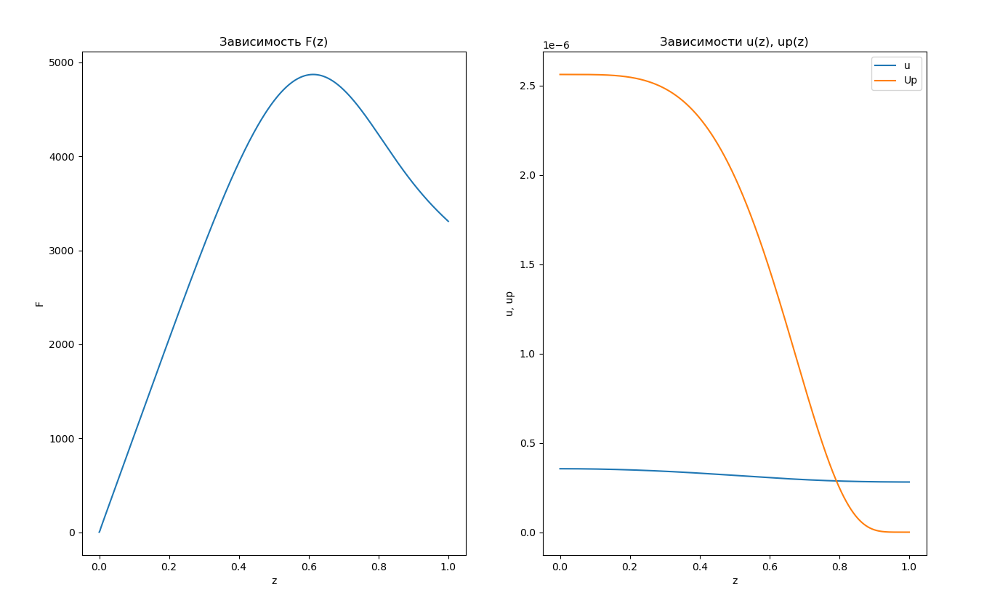
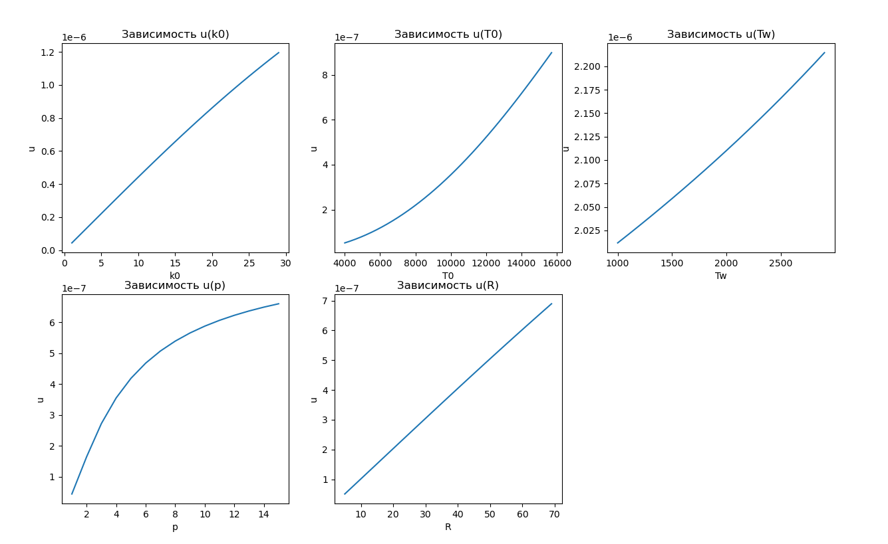

# Решение задачи Коши при реализации моделей, построенных на системе ОДУ, с использованием метода Рунге-Кутта IV порядка точности.

## Задание.
С заданием можно ознакомиться [здесь](task/lab_02.pdf).

## Зависимости для F(z), u(z), up(z):

## Зависимости для остальных параметров:

## Примечание:
Основная идея алгоритма заключается в поиске нужного параметра &xi;. Этот процесс осуществляется через метод дихотомии, внутри которого выполняется метод Рунге-Кутта. Таким образом, лучше писать программу на компилируемых языках.
